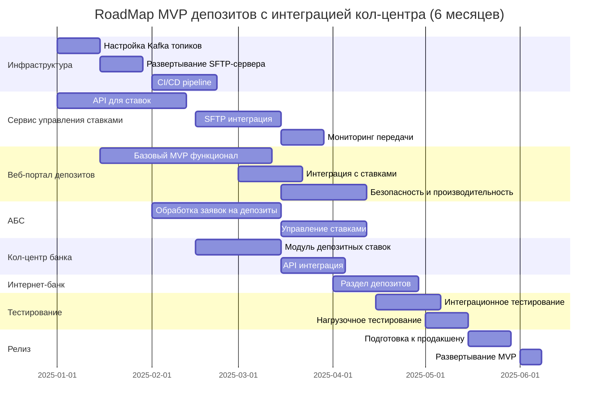

# RoadMap MVP депозитов с интеграцией кол-центра

## Ключевые вехи проекта

### Месяц 1 (Январь) - Инфраструктура
- ✅ Настройка Kafka для асинхронной интеграции
- ✅ Развертывание SFTP-сервера для партнеров
- ✅ Начало разработки сервиса управления ставками

### Месяц 2 (Февраль) - Базовая разработка  
- ✅ API сервиса ставок готов к интеграции
- ✅ Начата разработка веб-портала депозитов
- ✅ АБС готова принимать заявки через Kafka

### Месяц 3 (Март) - Интеграция кол-центров
- ✅ SFTP интеграция с партнерским кол-центром
- ✅ Модуль ставок в системе кол-центра банка
- ✅ Веб-портал интегрирован с сервисом ставок

### Месяц 4 (Апрель) - Завершение MVP
- ✅ Интернет-банк с разделом депозитов
- ✅ Полная интеграция кол-центра с API ставок
- ✅ Система мониторинга всех интеграций

### Месяц 5 (Май) - Тестирование
- ✅ End-to-end тестирование всех сценариев
- ✅ Нагрузочное тестирование критических компонентов
- ✅ Исправление найденных дефектов

### Месяц 6 (Июнь) - Релиз
- ✅ Развертывание в продакшен среде
- ✅ Обучение операторов кол-центра
- ✅ Мониторинг стабильности после запуска

## Критические зависимости

1. **Kafka → Сервис ставок → Веб-портал** - основная цепочка разработки
2. **Сервис ставок → Кол-центр** - API интеграция для консультирования  
3. **SFTP-сервер → Партнерский кол-центр** - файловый обмен ставками
4. **АБС → Обработка заявок** - backend процессы MVP
